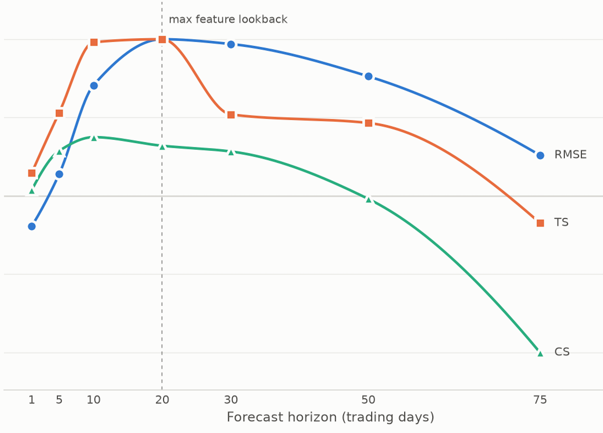

# Stock Log Return Forecasting

Built and served end to end on my own infrastructure and domain | nginx, Python, Flutter.<br>[](https://byebility.com)

### C (prediction model) & Python (IO)

- #### Ridge regression written directly in C, no external ML framework or numerical library used anywhere in the loop.

- #### Python side of repo handles only stock data scraping, parsing and preprocessing; uses *ctypes* to pass it to the C model.

## Overview

- Data is collected and validated by a self-written scraper
- *openmp* is used to parallelize feature calculation & training
- All features are centered, scaled and clipped
- Configurable independent prediction horizons (1/5/10/20 day returns by default)
- Universe and forecasting are restricted to companies with a complete history since 2016
- Weights are pretrained across a company universe, then fine-tuned and calibrated per ticker before each forecast
- Certain time windows are excluded from all training and kept for calibration and skill measurement
- True out-of-sample skill is measured against a zero-return RMSE, on unseen stocks during this excluded window
- 50+ features per sample
- Market reference: SPY

## Output

For a given ticker and date, each configured horizon returns:

- **Starting price**: same for all horizons
- **Expected return**: the fine-tuned prediction, bias corrected
- **Expected price**: starting price × exp(expected return)
- **Residual bias**: the ticker's average historical miss for this horizon, converted to dollars
- **Residual standard deviation**: the spread of residuals after the bias correction, converted to dollars
- **Forecast strength**: z-score of how unusual this forecast is relative to the ticker's own noise

*Note: the latter three are computed only on the timeframes excluded from training & finetuning.*

## Results <br> RMSE + IC

All metrics below are computed on companies and time windows never seen during training.

<p align="center">
  
  <br>
  <sub>RMSE improvement relative to a 0 log return baseline</sub>
  <br>
  <sub><em>TS</em> = time-series IC &nbsp;|&nbsp; <em>CS</em> = cross-sectional IC</sub>
</p>

*Observations*: features look back at most 20 days, and the results follow that window. All three metrics peak around 10 to 20 days. Close future is mostly noise and beyond a month, that same history carries too little relevant information. In between is where it fits.

*Notations*: $\hat r_{i,t}$ is the predicted log return for company $i$ at day $t$, and $r_{i,t}=\ln\big(C_{i,t+h}/C_{i,t}\big)$ is the realized one.

### RMSE Improvement

Performance is measured against a **zero log return baseline** (predicting no change):

$$
\text{RMSE Improvement}=\left(1-\frac{\text{RMSE}_{\text{model}}}{\text{RMSE}_{\text{baseline}}}\right)\times 100
$$

### IC - Information Coefficient

1) #### ***TS - time-series IC*** 

Per company, across time: does this company's realized return move with what the model predicted for it? 

*Pearson correlation* over all valid days of one company, then averaged across companies:

$$
TS_i=\frac{\text{cov}\big(\hat r_{i,t},r_{i,t}\big)}{\sigma_{\hat r}\sigma_r}
$$

2) #### ***CS - cross-sectional IC***

Per day, across companies: on a given day, does the model rank companies correctly against each other?

*Pearson correlation* over all companies on one day, then averaged across days:

$$
CS_t=\frac{\text{cov}\big(\hat r_{i,t},r_{i,t}\big)}{\sigma_{\hat r}\sigma_r}
$$

| Horizon |    RMSE |      TS |      CS |
| ------: | ------: | ------: | ------: |
|   1 day | -0.179% | +0.0227 | +0.0024 |
|  5 days | +0.129% | +0.0825 | +0.0188 |
| 10 days | +0.654% | +0.1522 | +0.0245 |
| 20 days | +0.925% | +0.1553 | +0.0209 |
| 30 days | +0.897% | +0.0807 | +0.0185 |
| 50 days | +0.706% | +0.0723 | -0.0013 |
| 75 days | +0.240% | -0.0269 | -0.0654 |

*Positive values indicate lower RMSE than the baseline.*

*Observations*:
- Regarding RMSE, all effects are small in absolute terms, but my baseline is already very hard to beat at short horizons.
- TS runs several times larger than CS at every horizon. TS keeps the market-wide component, since predictions and realized returns trend together across the whole universe when the market moves, while IC removes it by default. The gap between the two columns is exactly that market component.
*Positive values indicate lower RMSE than the baseline.*

## Features & Mathematics

Notations: daily log return $r_s=\ln(C_s/C_{s-1})$, lookback window $L\in\{5,10,20\}$, $S$ = stock, $M$ = market.

- **Momentum**: log return

  $$\ln\frac{C_t}{C_{t-L}}$$

- **Relative volume**: today's volume vs its average

  $$\ln\frac{V_t}{\bar V_L}$$

- **Volatility**: standard deviation of daily log returns

  $$\sqrt{\frac{1}{L}\sum\big(r_i-\bar r\big)^2}$$

- **Dispersion**: how spread out the price path is around its own mean, divided by that mean

  $$\frac{1}{\bar C}\sqrt{\frac{1}{L}\sum\big(C_i-\bar C\big)^2}$$

- **Stability**: how much returns fluctuate, the RMS of the change in returns

  $$\sqrt{\frac{1}{L-1}\sum\big(r_i-r_{i-1}\big)^2}$$

- **Persistence**: the lag-1 Pearson correlation

  $$\frac{\frac{1}{L-1}\sum\big(r_i-\bar r_X\big)\big(r_{i+1}-\bar r_Y\big)}{\sigma_X\,\sigma_Y}$$

  $X$ = first $L-1$ returns of the window, $Y$ = last $L-1$.

- **Gap, intraday move, range, closing strength**: same day price action

  $$\ln\frac{O_t}{C_{t-1}}\qquad \ln\frac{C_t}{O_t}\qquad \ln\frac{\mathrm{Hi}_t}{\mathrm{Lo}_t}\qquad \frac{C_t-\mathrm{Lo}_t}{\mathrm{Hi}_t-\mathrm{Lo}_t}$$

- **Relative VWAP, relative transaction count**: like relative volume

  $$\ln\frac{VW_t}{\overline{VW}_L}\qquad \ln\frac{N_t}{\bar N_L}$$

- **Average trade size slope**: today's dollar size per trade against the window's

  $$\ln\frac{VW_t\,V_t/N_t}{\sum VW\,V\big/\sum N}$$

- **Relative volatility** (stock vs market): stock returns dispersed around the *market's* mean return

  $$\sqrt{\frac{1}{L}\sum\big(r_S-\bar r_M\big)^2}$$

- **Market correlation** (stock vs. market): Pearson correlation between stock and market returns

  $$\frac{\frac{1}{L}\sum\big(r_S-\bar r_S\big)\big(r_M-\bar r_M\big)}{\sigma_S\,\sigma_M}$$

- **Market beta**: stock sensitivity to market returns, fit on the $L-1$ returns ending at $t-1$, so today stays out of the fit

  $$\frac{\frac{1}{L-1}\sum\big(r_S-\bar r_S\big)\big(r_M-\bar r_M\big)}{\sigma_M^2}$$

- **Residual return**: stock return unexplained by the market, over the same window as $\beta$

  $$r_{S,t}-\alpha-\beta\,r_{M,t}\qquad \text{with}\qquad \alpha=\bar r_S-\beta\,\bar r_M$$

- **Centering, scaling and clipping**: uses the training set mean and standard deviation:

$$z=\frac{x-\bar x}{\sigma_x}$$

, where x is clipped if needed

$$x=\max\!\Big(\bar x-c\,\sigma_x,\;\min\big(\bar x+c\,\sigma_x,\;x\big)\Big)$$


## Training universe

One JSON file per company, plus a single SPY file used as the market reference. All are aligned in time and for each day they reveal `v`, `vw`, `o`, `c`, `h`, `l`, `t`, `n`.

A company enters the universe only if:
 
- every field of every sample is strictly positive
- the history is complete and unbroken over the full data range

Everything else is dropped by the scraper. The same check runs before a forecast, so a ticker that could not have entered training cannot be predicted on either.


## Model

Each horizon is an independent ridge regression on log-returns. They are defined in the C part of the code:
```
int NR_HORIZONS = 4;
int HORIZONS[4] = {1, 5, 10, 20};
```
The Python side reads this definition and creates the appropriate *model_weights* file, while the C side trains every horizon listed.

by default, for 72 features per sample:

| Horizon | Look-ahead | Weight slice | Bias index |
|---|---|---|---|
| 1 day  | `t + 1`  | `weights[0:72]`    | `bias[0]` |
| 5 day  | `t + 5`  | `weights[72:144]`  | `bias[1]` |
| 10 day | `t + 10` | `weights[144:216]` | `bias[2]` |
| 20 day | `t + 20` | `weights[216:288]` | `bias[3]` |

All parameters flow through both training stages below: first fit across the whole universe, then finetune to one company at a time.

## Training - 2 stages

### Stage 1 | Cross-sectional pretraining

Which days are trainable can be decided by different training rules (*model/utils/train_rules.c*). A rule can describe any pattern of held-out periods, such as a single continous calendar window or a 30-day holdout every 90 days. The same rules are used by pretraining, finetuning and forecasting, synchronized using Unix timestamps, so all three always agree on what the model has and hasn't seen.

Training walks forward through calendar time across the *entire* company universe, skipping the held-out periods:

1. At each trading day, compute the prediction error for every company in the universe and average the gradient across all of them: a full batch over the cross-section, to minimize the effects of constant Market features among all companies on that day.
2. After a full pass, recompute RMSE on all 4 horizons. If every horizon got strictly worse, halve the learning rate, otherwise repeat.

The weights are also constantly saved statically on disk every couple of cycles during training.

### Centering and scaling

All features are computed once at startup for every sample, in parallel, and reused across training cycles.

They are centered, clipped and scaled using each feature's row's mean and standard deviation. Without it training proved to be too slow. Below is the graph of the weights' evolution over a couple hours of training...


### VS

Current IQR


### Stage 2 | Per-ticker finetuning & calibration

Every time a forecast is requested for a ticker, the pretrained weights are adapted specifically to that company before predicting, using ridge regression once again.

If the most recent bar in the data belongs to today's still-open session, it's excluded from both fine-tuning and calibration, so the model never finetunes or predicts on a price that hasn't closed yet.

1. **Fine-tune** on that one company, over its whole history except the held-out periods.
2. **Calibrate** on the held-out periods only. Predictions there are compared against what actually happened, giving the per-horizon bias and after removing it, the residual standard deviation. Neither stage fit on that window, so these are real out-of-sample residuals for this ticker.
3. **Predict** from the last closed bar, apply the bias, divide by the residual standard deviation for the forecast strength.


### Project Layout

```
_
├── LICENSE
├── README.md
├── io_layer -------------------- Python side: gathers and processes stock data
│   ├── __init__.py
│   ├── data_types.py
│   ├── my_main.py
│   ├── model
│   │   ├── __init__.py
│   │   └── model.py
│   └── training
│       ├── __init__.py
│       ├── model_weights
│       ├── scrape_data.py
│       ├── train.py
│       ├── market
│       │   └── empty
│       ├── stocks
│       │   └── empty
│       └── untrained_stocks
│           └── empty
├── model ----------------------- Raw C implementation of the actual model
│   ├── Makefile
│   ├── model_weights
│   ├── build
│   │   └── empty
│   ├── features ---------------- Turns raw stock data into numerical signals
│   │   ├── features.c
│   │   └── features_helper.c
│   ├── prediction
│   │   └── predict.c
│   ├── src
│   │   └── main.c
│   ├── training ---------------- Contains the math for fitting the model
│   │   ├── calculate_gradients.c
│   │   ├── center_and_scale.c
│   │   ├── finetune.c
│   │   └── train.c
│   └── utils ------------------- Shared code for computing predictions and errors
│       ├── utils.h
│       ├── utils.c
│       ├── global.c
│       ├── train_rules.c
│       └── time.c
└── plots
    ├── *.png
    └── stock_universe_plots
        └─ *.png
```
