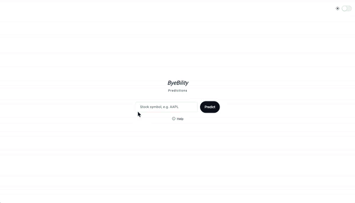
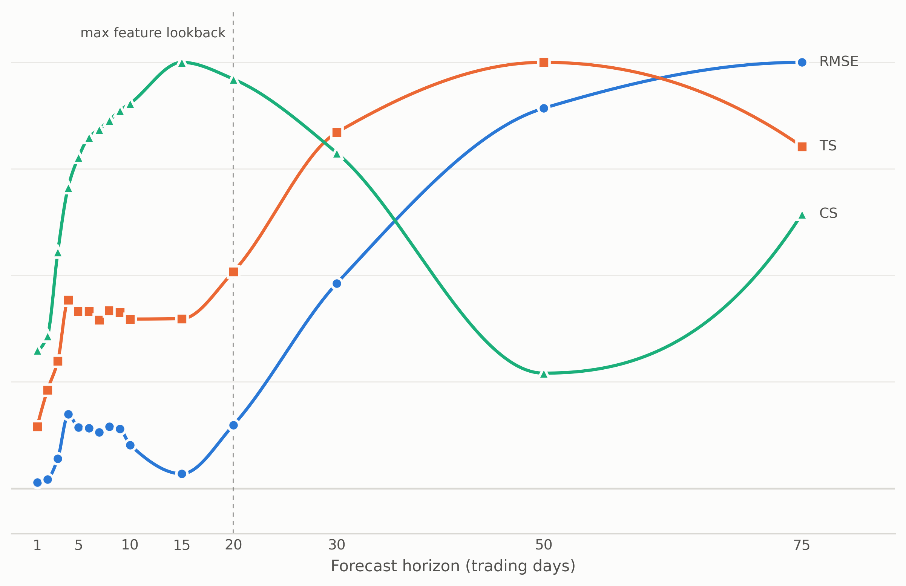
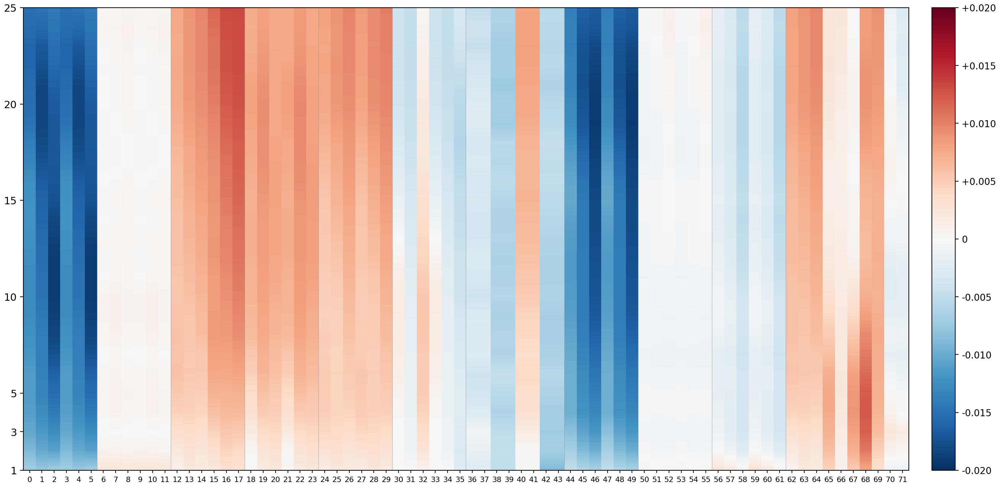
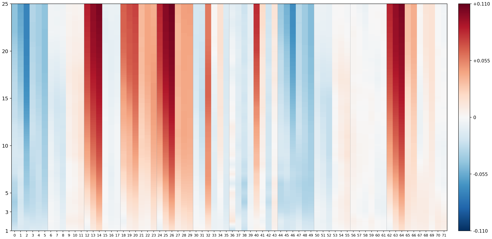
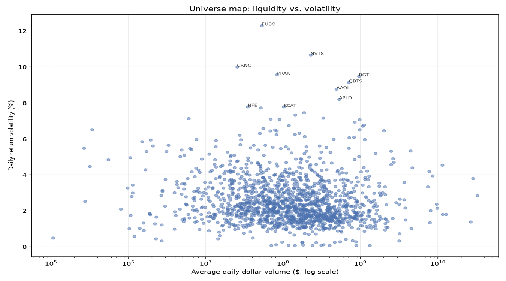

# [](https://doi.org/10.5281/zenodo.22927824) <br> Multi-Horizon Stock Log Return Forecasting<br> in Raw C

Built and self-hosted a website around the ML model | nginx, Python, Flutter.<br>
[](https://byebility.com)

<p align="center">
  
  <br>
  <a href="https://byebility.com">ByeBility.com</a>
</p>

### C (prediction model) & Python (I/O)

- #### Ridge regression written directly in raw C, no external ML framework or numerical library used anywhere in the loop.

- #### Python side of repo handles only stock data scraping, parsing and preprocessing, and uses *ctypes* to pass it to the C model.

## Overview

- Data is collected and validated by a self-written scraper
- *openmp* is used to parallelize feature computation & training
- All features are centered, scaled and clipped
- Configurable independent prediction horizons
- Universe and forecasting are restricted to companies with a complete history since 2016
- Weights are pretrained across a company universe, then fine-tuned and calibrated per ticker before each forecast
- Certain time windows are excluded from all training and kept for calibration and skill measurement

## Output

For a given ticker and date, each configured horizon returns:

- **Starting price**: same for all horizons
- **Expected return**: the fine-tuned prediction, bias corrected
- **Expected price**: starting price × exp(expected return)
- **Residual bias**: the ticker's average historical miss for this horizon, converted to dollars
- **Residual standard deviation**: the spread of residuals after the bias correction, converted to dollars
- **Forecast strength**: How strong this forecast is relative to the model’s typical error for this ticker, expressed as a percentage of residual sd.

*Note: the standard deviation is computed only on the timeframes excluded from training & finetuning.*

## Results <br> RMSE + IC

### Walk-forward test

<p align="center">
  
  <br>
  <sub>Each series is divided by its own largest absolute value.</sub>
  <br>
  <sub>RMSE improvement relative to a 0 log return baseline</sub>
  <br>
  <sub><em>TS</em> = time-series IC &nbsp;|&nbsp; <em>CS</em> = cross-sectional IC</sub>
</p>

The model is trained only on data from 2016 through 2024, inclusive, on ~900 companies, then scored from 2025 till today on ~100 companies that were held-out during training.

Therefore, all metrics are computed on companies and time windows never seen during training with no lookahead, simulating real live forecasting conditions.

*Note*: Each horizon is an independent model with its own weights, they only share the same features for a given company at a given time.

*Observations*: 
- Features look back at most 20 days, and the cross-sectional IC results, that ignore the market part of the forecast, follow that window exactly. Close future is mostly noise and beyond 30 days, that same history carries too little relevant information, in between is where it fits.
- All three metrics are positive at every horizon. Cross-sectional IC constantly climbs and peaks at day 15.
- Time-series IC and RMSE relative gain continue increasing on the far future because both include the market part of the forecast.
- The period of interest therefore remains 1-20 days, when the model actually holds stock specific prediction power.

<br>

*Notations*: $\hat r_{i,t}$ is the predicted log return for company $i$ at day $t$, and $r_{i,t}=\ln\big(C_{i,t+h}/C_{i,t}\big)$ is the realized one.

### RMSE Improvement

Performance is measured against a **zero log return baseline** (predicting no change):

$$
\text{RMSE Improvement}=\left(1-\frac{\text{RMSE}_{\text{model}}}{\text{RMSE}_{\text{baseline}}}\right)\times 100
$$

### IC - Information Coefficient

1) #### ***TS - time-series IC*** 

Per company, across time: does this company's realized return move with what the model predicted for it? 

*Pearson correlation* over all valid days of one company, then averaged across companies:

$$
TS_i=\frac{\text{cov}\big(\hat r_{i,t},r_{i,t}\big)}{\sigma_{\hat r}\sigma_r}
$$

2) #### ***CS - cross-sectional IC***

Per day, across companies: on a given day, does the model rank companies correctly against each other?

*Pearson correlation* over all companies on one day, then averaged across days:

$$
CS_t=\frac{\text{cov}\big(\hat r_{i,t},r_{i,t}\big)}{\sigma_{\hat r}\sigma_r}
$$

| Horizon |    RMSE |   TS IC |   CS IC |
| ------: | ------: | ------: | ------: |
|   1 day | +0.019% | +0.0265 | +0.0123 |
|  2 days | +0.030% | +0.0422 | +0.0135 |
|  3 days | +0.098% | +0.0546 | +0.0210 |
|  4 days | +0.243% | +0.0809 | +0.0267 |
|  5 days | +0.201% | +0.0761 | +0.0294 |
|  6 days | +0.198% | +0.0762 | +0.0311 |
|  7 days | +0.185% | +0.0723 | +0.0318 |
|  8 days | +0.203% | +0.0763 | +0.0326 |
|  9 days | +0.196% | +0.0756 | +0.0335 |
| 10 days | +0.142% | +0.0727 | +0.0341 |
| 15 days | +0.048% | +0.0729 | +0.0378 |
| 20 days | +0.208% | +0.0932 | +0.0363 |
| 30 days | +0.675% | +0.1530 | +0.0297 |
| 50 days | +1.251% | +0.1831 | +0.0102 |
| 75 days | +1.402% | +0.1469 | +0.0243 |

*Positive RMSE values indicate lower RMSE than the baseline.*

***Observations** for the time window of interest 1-20 days*:
- All effects are small in absolute terms, but my baseline is already very hard to beat.
- An earlier run, trained on 2016–2023 (inclusive) and scored from 2024 til present, showed a noticeably weaker signal (CS IC peaked at +0.014 at 4 days and faded by 10 days). Either the model benefits that much from training on the most recent year, or 2024 was an unusually hard year for it.
- RMSE improvement peaks at 4 days (+0.243%) and stays near +0.2% until day 9. Cross-sectional IC is positive at every horizon.
- The time-series IC runs several times larger than the cross-sectional IC at every horizon. The time-series keeps the market component, while cross-sectional IC removes it by default. The gap between the two is exactly that market component.


## Features & Mathematics

Notations: daily log return $r_s=\ln(C_s/C_{s-1})$, lookback window $L\in\{5,10,20\}$, $S$ = stock, $M$ = market.

- **Momentum**: log return

  $$\ln\frac{C_t}{C_{t-L}}$$

- **Relative volume**: today's volume vs its average

  $$\ln\frac{V_t}{\bar V_L}$$

- **Volatility**: standard deviation of daily log returns

  $$\sqrt{\frac{1}{L}\sum\big(r_i-\bar r\big)^2}$$

- **Dispersion**: how spread out the price path is around its own mean, divided by that mean

  $$\frac{1}{\bar C}\sqrt{\frac{1}{L}\sum\big(C_i-\bar C\big)^2}$$

- **Stability**: how much returns fluctuate, the RMS of the change in returns

  $$\sqrt{\frac{1}{L-1}\sum\big(r_i-r_{i-1}\big)^2}$$

- **Persistence**: the lag-1 Pearson correlation

  $$\frac{\frac{1}{L-1}\sum\big(r_i-\bar r_X\big)\big(r_{i+1}-\bar r_Y\big)}{\sigma_X\,\sigma_Y}$$

  $X$ = first $L-1$ returns of the window, $Y$ = last $L-1$.

- **Gap, intraday move, range, closing strength**: same day price action

  $$\ln\frac{O_t}{C_{t-1}}\qquad \ln\frac{C_t}{O_t}\qquad \ln\frac{\mathrm{Hi}_t}{\mathrm{Lo}_t}\qquad \frac{C_t-\mathrm{Lo}_t}{\mathrm{Hi}_t-\mathrm{Lo}_t}$$

- **Relative VWAP, relative transaction count**: like relative volume

  $$\ln\frac{VW_t}{\overline{VW}_L}\qquad \ln\frac{N_t}{\bar N_L}$$

- **Average trade size slope**: today's dollar size per trade against the window's

  $$\ln\frac{VW_t\,V_t/N_t}{\sum VW\,V\big/\sum N}$$

- **Relative volatility** (stock vs market): stock returns dispersed around the *market's* mean return

  $$\sqrt{\frac{1}{L}\sum\big(r_S-\bar r_M\big)^2}$$

- **Market correlation** (stock vs. market): Pearson correlation between stock and market returns

  $$\frac{\frac{1}{L}\sum\big(r_S-\bar r_S\big)\big(r_M-\bar r_M\big)}{\sigma_S\,\sigma_M}$$

- **Market beta**: stock sensitivity to market returns, fit on the $L-1$ returns ending at $t-1$, so today stays out of the fit

  $$\frac{\frac{1}{L-1}\sum\big(r_S-\bar r_S\big)\big(r_M-\bar r_M\big)}{\sigma_M^2}$$

- **Residual return**: stock return unexplained by the market, over the same window as $\beta$

  $$r_{S,t}-\alpha-\beta\,r_{M,t}\qquad \text{with}\qquad \alpha=\bar r_S-\beta\,\bar r_M$$

- **Centering, scaling and clipping**: uses the training set mean and standard deviation:

$$z=\frac{x-\bar x}{\sigma_x}$$

, where x is clipped if needed

$$x=\max\!\Big(\bar x-c\sigma_x,\min\big(\bar x+c\sigma_x,x\big)\Big)$$

## Raw Features' Correlations

These heatmaps show how the 72 raw features correlate with future stock log returns across 1-25 day horizons, computed over 10 years of daily data using 896 companies.

### Cross-sectional Pearson (per day, across companies)

<p align="center">
  
</p>

### Time-series Pearson (per company, across time)

<p align="center">
  
</p>

<a href="plots/features.png"><u>Detailed results here.</u></a>

## Training universe

One JSON file per company, plus a single SPY file used as the market reference. All are aligned in time and for each day they reveal `v`, `vw`, `o`, `c`, `h`, `l`, `t`, `n`.

A company enters the universe only if:
 
- every field of every sample is strictly positive
- the history is complete and unbroken over the full data range

Everything else is dropped by the scraper. The same check runs before a forecast, so a ticker that could not have entered training cannot be predicted on either.




## Model

Each horizon is an independent ridge regression on log-returns. They are defined in the C part of the code:
```
int NR_HORIZONS = 4;
int HORIZONS[4] = {1, 5, 10, 20};
```
The Python side reads this definition and creates the appropriate *model_weights* file, while the C side trains every horizon listed.

by default, for 72 features per sample:

| Horizon | Look-ahead | Weight slice | Bias index |
|---|---|---|---|
| 1 day  | `t + 1`  | `weights[0:72]`    | `bias[0]` |
| 5 day  | `t + 5`  | `weights[72:144]`  | `bias[1]` |
| 10 day | `t + 10` | `weights[144:216]` | `bias[2]` |
| 20 day | `t + 20` | `weights[216:288]` | `bias[3]` |

All parameters flow through both training stages below: first fit across the whole universe, then finetune to one company at a time.

## Training - 2 stages

### Stage 1 | Cross-sectional pretraining

Which days are trainable can be decided by different training rules (*model/utils/train_rules.c*). A rule can describe any pattern of held-out periods, such as a single continous calendar window or a 30-day holdout every 90 days. The same rules are used by pretraining, finetuning and forecasting, synchronized using Unix timestamps, so all three always agree on what the model has and hasn't seen.

Training walks forward through calendar time across the *entire* company universe, skipping the held-out periods:

1. At each trading day, compute the prediction error for every company in the universe and average the gradient across all of them: a full batch over the cross-section, to minimize the effects of constant Market features among all companies on that day.
2. After a full pass, recompute RMSE on all 4 horizons. If every horizon got strictly worse, halve the learning rate, otherwise repeat.

The weights are also constantly saved statically on disk every couple of cycles during training.

### Centering and scaling

All features are computed once at startup for every sample, in parallel, and reused across training cycles.

They are centered, clipped and scaled using each feature's row's mean and standard deviation.

Multilinearity between features is likely, due to most of them being logs derived from the same kind of data, therefore Ridge Regression is needed. The lambda penalty penalizes equally, so standardization is needed.

Even though the features were chosen to be around the same scale, without centering and scaling, they drift apart dramatically, illustrated by the graphs below:


### VS

Scaled & centered (**NOT CLIPPED**) features' IQR


### Stage 2 | Per-ticker finetuning & calibration

Every time a forecast is requested for a ticker, the pretrained weights are adapted specifically to that company before predicting, using ridge regression once again.

If the most recent bar in the data belongs to today's still-open session, it's excluded from both fine-tuning and calibration, so the model never finetunes or predicts on a price that hasn't closed yet.

1. **Fine-tune** on that one company, over its whole history except the held-out periods.
2. **Calibrate** on the held-out periods only. Predictions there are compared against what actually happened, giving the per-horizon bias and after removing it, the residual standard deviation. Neither stage fit on that window, so these are real out-of-sample residuals for this ticker.
3. **Predict** from the last closed bar, apply the bias, divide by the residual standard deviation for the forecast strength.

## How to run

### Requirements: 

- Python I/O side uses *requests* to pull live stock data
    
      pip install requests
  
- MacOS uses Clang instead of standard GCC, therefore the Makefile requires OpenMP support for building the parallelized version on MacOS, otherwise juse use *make all_serial*. I copied the OpenMP binaries from a Conda env, therefore I made the Makefile to expect actual binaries, using *homebrew* or *macports* will not work without modifying it.

- The Python side needs [Alpaca](https://docs.alpaca.markets/us/reference/stockbars) credentials to pull data, accesible through the environment as ALPACA_KEY & ALPACA_SECRET.
      
      ALPACA_KEY = os.environ.get("ALPACA_KEY")
      ALPACA_SECRET = os.environ.get("ALPACA_SECRET")

### Full Setup

      git clone https://github.com/1ul1/QuantitativeMarketPrediction
      cd QuantitativeMarketPrediction
      mkdir ./io_layer/training/market; mkdir ./io_layer/training/stocks; mkdir ./io_layer/training/untrained_stocks
      rm -rf ./io_layer/training/market/*; rm -rf ./io_layer/training/stocks/*; rm -rf ./io_layer/training/untrained_stocks/*
      python3 -m io_layer.my_main get_data (download training universe)
      cd model; make; cd ..; python3 -m io_layer.my_main train
      cp io_layer/training/model_weights ./model/
      python3 -m io_layer.my_main AAPL

If everything is set up correctly, a forecast for Apple's stock should be displayed.

*Note*: change make to make all_linux or make all_serial if needed. Implicit *all* rule is for Macos, linked against local OpenMP binaries.

### Predict a ticker
      python3 -m io_layer.my_main {ticker} 
                                  e.g python3 -m io_layer.my_main AAPL
                                  (you can use any US equity ticker)
### Train

      python3 -m io_layer.my_main train

,when done

      cp io_layer/training/model_weights ./model/

- To get a training universe to train on:

      mkdir ./io_layer/training/market; mkdir ./io_layer/training/stocks; mkdir ./io_layer/training/untrained_stocks
      rm -rf ./io_layer/training/market/*; rm -rf ./io_layer/training/stocks/*; rm -rf ./io_layer/training/untrained_stocks/*
      python3 -m io_layer.my_main get_data

### Replicate my results (RMSE + IC)

The Python side *get_data* module randomly selects 1 in 10 pulled stocks to be held-out during training and used for verification only. Therefore, to replicate my results you need to force these 3 dirs at *./io_layer/training/* to match exactly this structure:
[ls ./io_layer/training/market](./plots/replicate_results/market) & [ls ./io_layer/training/stocks](./plots/replicate_results/stocks) & [ls ./io_layer/training/untrained_stocks](./plots/replicate_results/untrained_stocks).

Additionally, the python scraper at [./io_layer/training/scrape_data.py](./io_layer/training/scrape_data.py), must only pull data from 2016-01-01 to 2026-09-14, so hardcode *YESTERDAY* to be 2026-09-14.

### Project Layout

```
QuantitativeMarketPrediction
_
├── LICENSE
├── README.md
├── io_layer -------------------- Python side: gathers and processes stock data
│   ├── __init__.py
│   ├── data_types.py
│   ├── my_main.py
│   ├── model
│   │   ├── __init__.py
│   │   └── model.py
│   └── training
│       ├── __init__.py
│       ├── model_weights
│       ├── scrape_data.py
│       ├── train.py
│       ├── market -------------- Training universes directories
│       │   └── empty
│       ├── stocks
│       │   └── empty
│       └── untrained_stocks
│           └── empty
├── model ----------------------- Raw C implementation of the actual model
│   ├── Makefile
│   ├── model_weights
│   ├── build
│   │   └── empty
│   ├── features ---------------- Turns raw stock data into numerical signals
│   │   ├── features.c
│   │   └── features_helper.c
│   ├── prediction
│   │   └── predict.c
│   ├── src
│   │   └── main.c
│   ├── training ---------------- Contains the math for fitting the model
│   │   ├── calculate_gradients.c
│   │   ├── center_and_scale.c
│   │   ├── finetune.c
│   │   └── train.c
│   └── utils ------------------- Shared code for computing predictions and errors
│       ├── utils.h
│       ├── utils.c
│       ├── global.c
│       ├── train_rules.c
│       └── time.c
├── plots
│   ├── *.png
│   └── stock_universe_plots
│       └─ *.png
│
```
